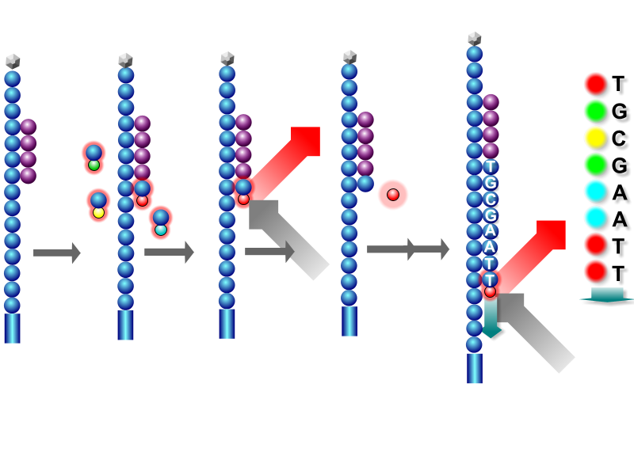
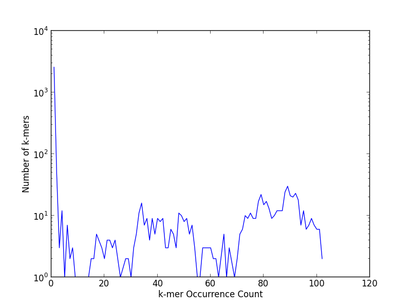

First, download ADAM's artifacts from [this link](https://s3.amazonaws.com/bdgenomics-test/adam.zip)
to your `usb` directory and unzip it. *NOTE:* ADAM is not designed for Windows and requires the `bash`
shell to be installed. We don't recommend trying ADAM on Windows unless you're feeling very adventurous.
To run ADAM, you'll need to set the path to your Spark installation:

<pre class="prettyprint lang-bsh">
export SPARK_HOME=usb/spark
</pre>

[ADAM](https://www.github.com/bigdatagenomics/adam) is an open-source library and command line
toolkit for exploring genomic data. In this chapter, we will use ADAM to explore a short portion
of a human genome. ADAM is built on Spark and also provides an interactive shell. Our first two
exercises will use the ADAM command line tools, and we'll use the ADAM shell for the last two
exercises.

In this exercise, we'll use a several hundred base pair long fragment of a human genome.
Conceptually, the human genome contains 25 different chromosomes (22 "autosomal" chromosomes,
the X/Y sex chromosomes, and a mitochondrial chromosome). Each person inherits two copies of each
chromosome _except_ for the mitochondrial chromosome; one is inherited from your mother, and one is
from your father. The mitochondrial chromosome is always inherited from your mother. Each chromosome
is a long string made out of the letters A, C, G, and T. The chromosomes vary in length from 250
million bases on chromosome 1 down to 50 million bases on the Y chromosome.

When we sequence a genome, we get the data back as _short reads_. These short reads are 100-250
letter long _samples_ of your genome. No sequencer yet can read a whole chromosome at once. Instead,
we cut the DNA into fragments, and sequence the fragments. The sequencers themselves are "massively
parallel"; in parallel, we attach a dye to the current base on each read. We then take a picture of
the dyes, strip the current base, and repeat until we are out of bases. This process is called
_sequencing by synthesis_.

The Human Genome Project assembled the structure of the human genome, which we refer to as the _human
reference genome_. On average, the genome of two humans is different only at one in every 1000 bases.
Since humans are so similar, to process the reads, we _align_ each read to a location on the human
genome. Once the reads are aligned, we can identify locations where the genome we are looking at is
different from the reference genome. We call these locations _variants_.

## The ADAM Data Format

Current formats for storing genomic data rely on a hand-maintained specification. This makes it
difficult to make libraries that are consistent across platforms. In ADAM, we chose to define an
explicit schema for each datatype, which is implemented using [Avro](http://avro.apache.org). We
then store the data on disk using the [Parquet](http://parquet.incubator.apache.org) columnar
storage format.

The reads we will process are currently stored in the Sequence Alignment/Mapping (SAM) format, which
is a text based format. The ADAM command line understands both SAM and ADAM, but, let's convert the
data into the ADAM format by running the following command:

<pre class="prettyprint lang-bsh">
usb/$ adam/bin/adam-submit transform adam/NA12878.sam adam/NA12878.adam
</pre>

Once this command finishes, let's compare the size of the two files.

<pre class="prettyprint lang-bsh">
usb/$ ls -alh NA12878.sam
usb/$ du -h NA12878.adam
</pre>

Here, ADAM is about 50% smaller! While this is a toy example, SAM has a binary, compressed companion
called BAM. In practice, ADAM is approximately 20% smaller than compressed BAM files. This is due to
[Parquet](http://parquet.incubator.apache.org). Since Parquet stores each column individually,
it can apply column specific compression techniques like dictionary encoding for columns with low
cardinality, or run length encoding for highly repetitive columns. Parquet allows us to check the
size of each column; we can do this by running:

<pre class="prettyprint lang-bsh">
usb/$ export CLASSPATH=$(./adam/bin/compute-adam-classpath.sh)
usb/$ java parquet.hadoop.PrintFooter adam/NA12878.adam
</pre>

Three columns make up about 75% of the size of the file on disk. These columns store information
about the _quality_ of each base in the read. While Parquet is able to compress most fields well,
the quality scores are noisy and compress poorly without using lossy compression.

## Genome Visualization

One of the key metrics that we look at when processing genomes is the number of reads that cover
each location, or _coverage_. We can take a look at this using ADAM's visualization toolkit. First,
run the following command:

<pre class="prettyprint lang-bsh">
usb/$ adam/bin/adam-submit viz adam/NA12878.adam 20
</pre>

This will load up the reads from chromosome 20 in ADAM's visualization tool. Now, go to your web
browser, and navigate to `localhost:8080/freq`. This will show the coverage per position on the
chromosome. Initially, the screen will be blank; this is because the reads we have are not from the
start of the chromosome, but rather are from the middle. Enter the coordinates `224500` and `225500`
into the browser.

We can also visualize the exact reads by navigating to `localhost:8080/reads`.

## Interactive Analysis

ADAM can be used from the Scala Spark shell. We can bring up a Scala Spark shell that is configured to
use ADAM by running:

<pre class="prettyprint lang-bsh">
usb/$ adam/bin/adam-shell
</pre>

The prompt should appear within a few seconds. __Note:__ You may need to hit `[Enter]` once to clear
the log output.

1. Let's warm up by loading in a set of reads:

<pre class="prettyprint lang-bsh">
scala> import org.bdgenomics.adam.rdd.ADAMContext._
import org.bdgenomics.adam.rdd.ADAMContext._

scala> val reads = sc.loadAlignments("adam/NA12878.adam").cache()
reads: org.apache.spark.rdd.RDD[org.bdgenomics.formats.avro.AlignmentRecord] = MappedRDD[1] at map at ADAMContext.scala:132

scala> reads.count()
res1: Long = 565
</pre>

We should have loaded 565 reads up. Let's take a look at a read, which is stored in our Avro format
for describing reads:

<pre class="prettyprint lang-bsh">
scala> println(reads.first)
</pre>

[Avro](http://avro.apache.org) is a binary serialization format

2. *_k_-mer Analysis:* When analyzing reads, we frequently look at the substrings that make up the
reads. We refer to these substrings as _k_-mers, where _k_ is the length of the substring. These
substrings are interesting because they allow us to look at the sequence content of a genome. With
_k_-mers, we can tell how similar two samples are, and identify reads that are different from the
average human genome. In short, _k_-mer counting is like word count for genomics!

To get started, let's count _k_-mers in ADAM using _k_ = 20. We should wind up with 3271 _k_-mers.

<pre class="prettyprint lang-bsh">
scala> import org.bdgenomics.adam.rdd.read.AlignmentRecordContext._
import org.bdgenomics.adam.rdd.read.AlignmentRecordContext._

scala> val kmers = reads.adamCountKmers(20).cache()
kmers: org.apache.spark.rdd.RDD[(String, Long)] = ShuffledRDD[19] at reduceByKey at AlignmentRecordRDDFunctions.scala:225

scala> kmers.count()
res2: Long = 3271
</pre>

Let's now look at the distribution of _k_-mer counts. We can count the number of times that a
_k_-mer with multiplicity _m_ occurs by doing a `countByValue`, and then we'll print the data
locally:

<pre class="prettyprint lang-bsh">
scala> val counts = kmers.map(kv => kv._2).countByValue()
counts: scala.collection.Map[Long,Long] = Map(...)

scala> println(counts.toList.sortBy(kv => kv._1))
</pre>

You may notice something very odd; specifically, over 75% of all _k_-mers only occur once! Let's
take a look at the bases in these _k_-mers; since a `String` looks like a collection in Scala,
we can easily get a count of all of the bases in a _k_-mer by doing a `flatMap` and a
`countByValue`:

<pre class="prettyprint lang-bsh">
scala> val bases = kmers.filter(kv => kv._2 == 1).flatMap(kv => kv._1).countByValue()
bases: scala.collection.Map[Char,Long] = Map(G -> 9962, A -> 15815, C -> 11034, N -> 698, T -> 13811)
</pre>

You might notice something odd! While we only expected to have the letters *A*, *C*, *G*, and
*T* in our genomes, the letter *N* has shown up! What's happened here is that whenever a sequencer
can't tell whether the base it saw was one of the four nucleotides, the sequencer emits the letter
N. This means that all of the _k_-mers that only appear once are errors! If we look at the full
distribution of _k_-mers, we'll notice the _big_ spike at 1, and then two other peaks. These peaks
correspond roughly to the number of copies of each allele contained in the genome. The right peak
is sites where you only have one copy of the allele, and the left peak contains sites where the
alleles on both copies of your chromosome match.

This graph is pretty noisy since we're only looking at a short range of the genome. If we look at
the whole genome, these peaks very closely approximate Poisson distributions.

3. *Variant Calling:* Another common analysis we do is to look at the reads and determine where
we have bases that don't match the average human genome. We can do this by counting the number
of bases at each site in the genome. If most of the bases match the reference, then we probably
don't have a variant at that position.

To start this process, let's convert our reads to _pileups_. Pileups provide a coordinate-space
view of the data; e.g., they aggregate all of the bases at position _x_ from all of the reads that
_cover_ site _x_. When we do this, we can also count the average coverage of each position in our
dataset:

<pre class="prettyprint lang-bsh">
scala> val pileups = reads.adamRecords2Pileup().cache()
pileups: org.apache.spark.rdd.RDD[org.bdgenomics.formats.avro.Pileup] = FlatMappedRDD[36] at flatMap at Reads2PileupProcessor.scala:264

scala> import scala.math.{ min, max }
import scala.math.{min, max}

scala> val coverage = pileups.count().toDouble / (reads.map(_.getEnd.toInt).reduce(max) - reads.map(_.getStart.toInt).reduce(min)).toDouble
coverage: Double = 95.58793969849246
</pre>

To find all sites that contain variants, let's group all of the pileups together by the position
that they are at. Once we've done this, we can double check the coverage figure from above. If
we've done these two steps correctly, the two coverage measurements will match:

<pre class="prettyprint lang-bsh">
scala> val pileupsByPosition = pileups.filter(_.getReferenceBase != null).groupBy(_.getPosition).cache()
pileupsByPosition: org.apache.spark.rdd.RDD[(Long, Iterable[org.bdgenomics.formats.avro.Pileup])] = ShuffledRDD[41] at groupBy at <console>:25

scala> pileups.count().toDouble / pileupsByPosition.count().toDouble
res7: Double = 95.58793969849246
</pre>

Let's apply a simple algorithm to call variants. Since we've got two copies of each chromosome, we
expect to see one of the following:

* Both copies match the reference
* One copy matches the reference, and one copy is an alternate allele
* Both copies are alternate alleles

To figure out what we have at each position, we'll count the total number of bases we have at that
position, as well as the number of bases that match the reference. If less than 33% of bases match
the reference, it is likely that both copies are a mismatch against the reference genome. If the
number is between 33% and 66%, we likely have one copy that matches the reference, and one copy
that is a different allele. If the number is greater than 66%, it is likely that we have two copies
that match the reference:

<pre class="prettyprint lang-bsh">
scala> val referencePctByPosition = pileupsByPosition.map(kv => {
     | val (pos, piles) = kv
     | (pos, piles.filter(p => p.getReferenceBase == p.getReadBase).size.toDouble / piles.size.toDouble)
     | })
referencePctByPosition: org.apache.spark.rdd.RDD[(Long, Double)] = MappedRDD[42] at map at <console>:27
</pre>

We expect that the vast majority of sites (99.9%) will match the reference genome. Let's check to
see if this is the case:

<pre class="prettyprint lang-bsh">
scala> referencePctByPosition.filter(kv => kv._2 < 0.33).count
res9: Long = 0

scala> referencePctByPosition.filter(kv => kv._2 > 0.66).count
res10: Long = 594

scala> referencePctByPosition.filter(kv => kv._2 > 0.33 && kv._2 < 0.66).count
res11: Long = 3
</pre>

This is close to what we'd expect to see. In a real pipeline, we would use a probabilistic model
that would account for the probability that each base was sequenced correctly. If we apply a
more rigorous model, we are able to reduce this down to a single base.
